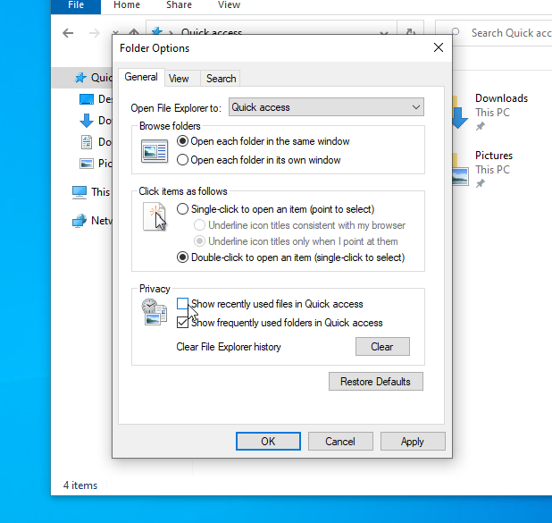
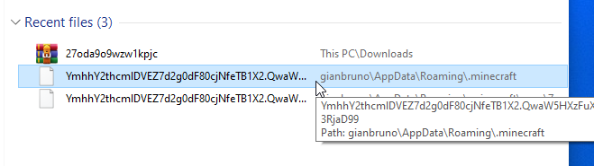
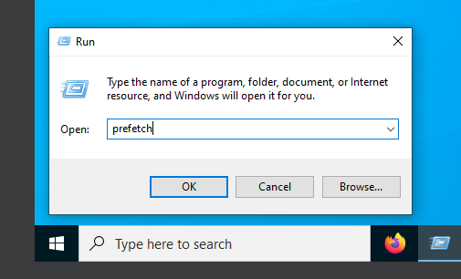
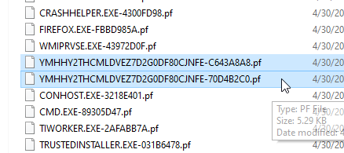
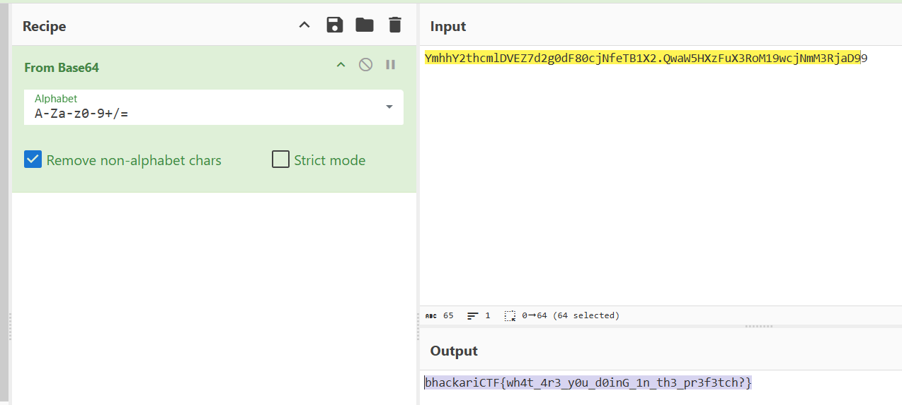

# Writeup: Gianbruno's Clicker 1 

*There are multiple ways to solve this challenge. Here, I will explain two.*

Opening File Explorer, you can notice that one of the **Quick Access** features is turned off

Once you enable it, a strange file named will pop up `YmhhY2thcmlDVEZ7d2g0dF80cjNfeTB1X2.QwaW5HXzFuX3RoM19wcjNmM3RjaD99`.

A cleaner solution, which also demonstrates that the cheat was actually executed, involves analyzing the prefetch files.

As you may know, only `.exe` files are logged in prefetch. Therefore, this is a spoofed file that was executed by the user.

In any case, decoding the filename from Base64 reveals the flag. Enjoy!

