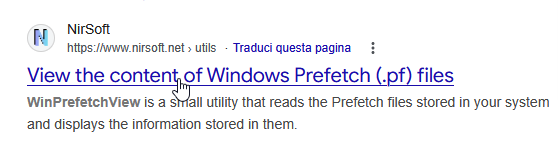
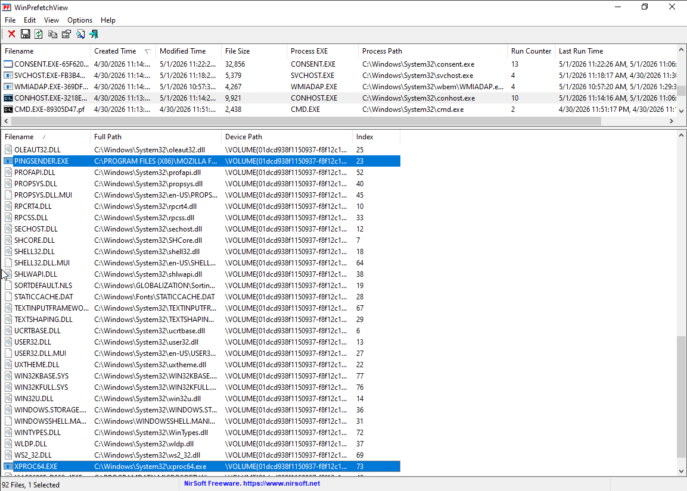
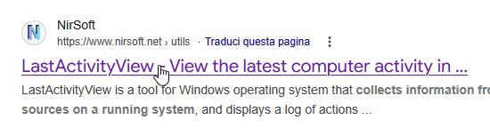
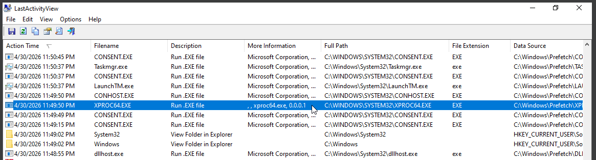
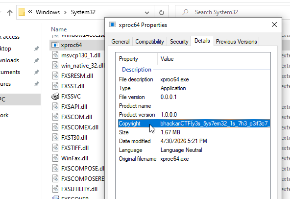

# Writeup: Gianbruno's Injection Client 1 

*As before, there are multiple ways to solve this challenge. Here, I will again explain two.*

A good starting point is to check the prefetch files to see which executables were run. However, they only provide limited information, mainly the filename, so we can use a tool like WinPrefetchView to analyze the contents of `.pf` files.

Among system processes, we can find a `conhost.exe`, meaning that some console-based program was executed, if we take a closer look at it we can see some suspicious imports such as `pingsender.exe` and diving deeper we can also see `xproc64.exe` the file we were looking for

Another approach is to use tools such as LastActivityView to reconstruct recent system activity. It aggregates information from multiple sources, such as prefetch files, recent documents, registry keys, and event logs, giving a clearer timeline of executed files and user actions.

Our attention should now be drawn to one peculiar detail. Look at this `.exe` file: it is located in the `System32` folder, yet it does not have a Microsoft Corporation signature!

Once we have identified the file, we can use the hint provided, which says that the flag is literally in the details tab of the file’s properties.

