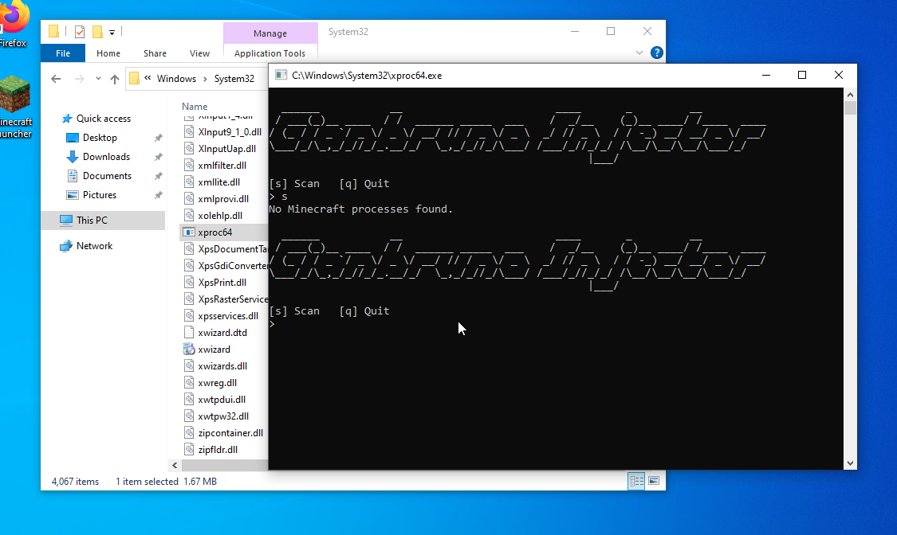
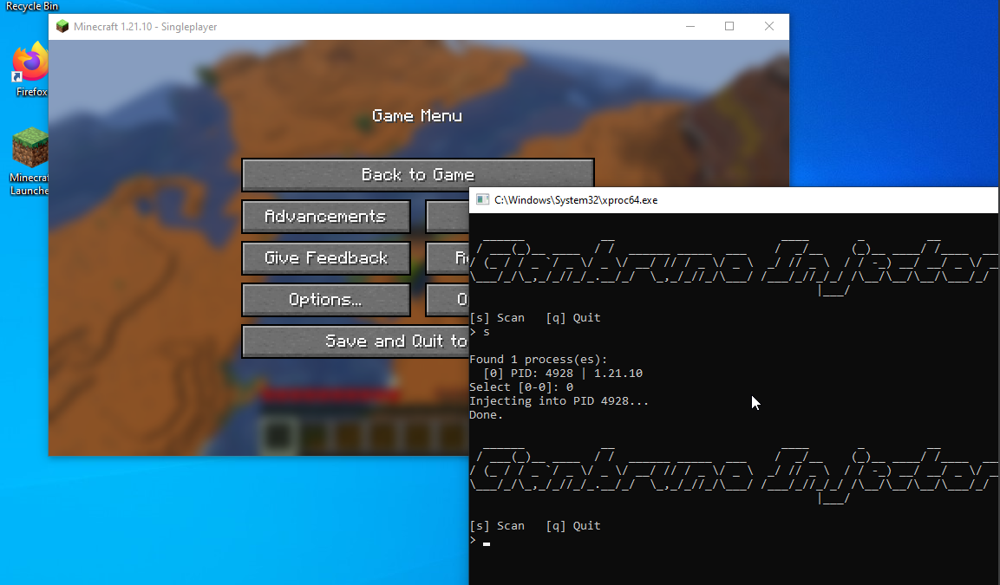
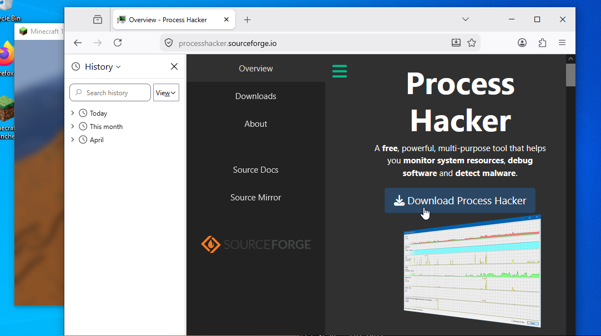
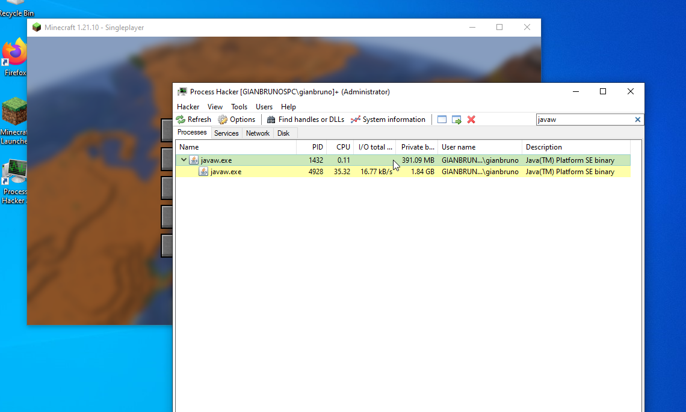
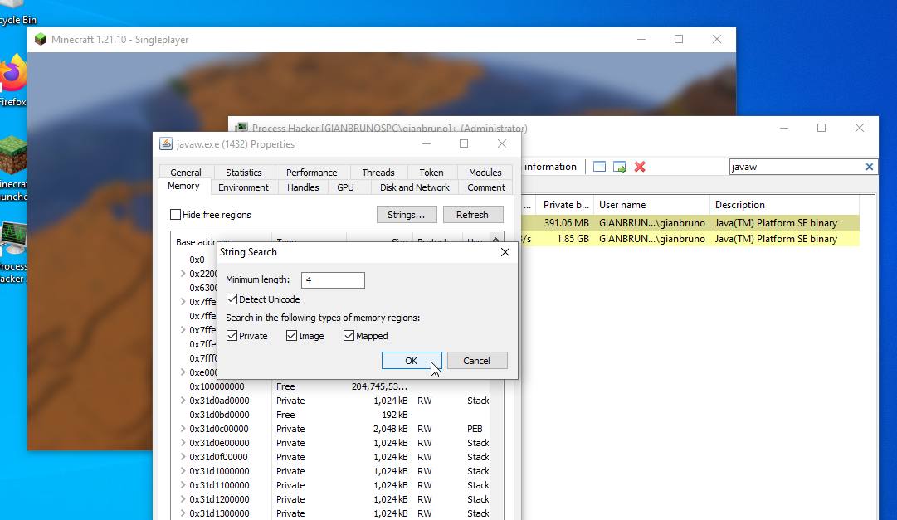
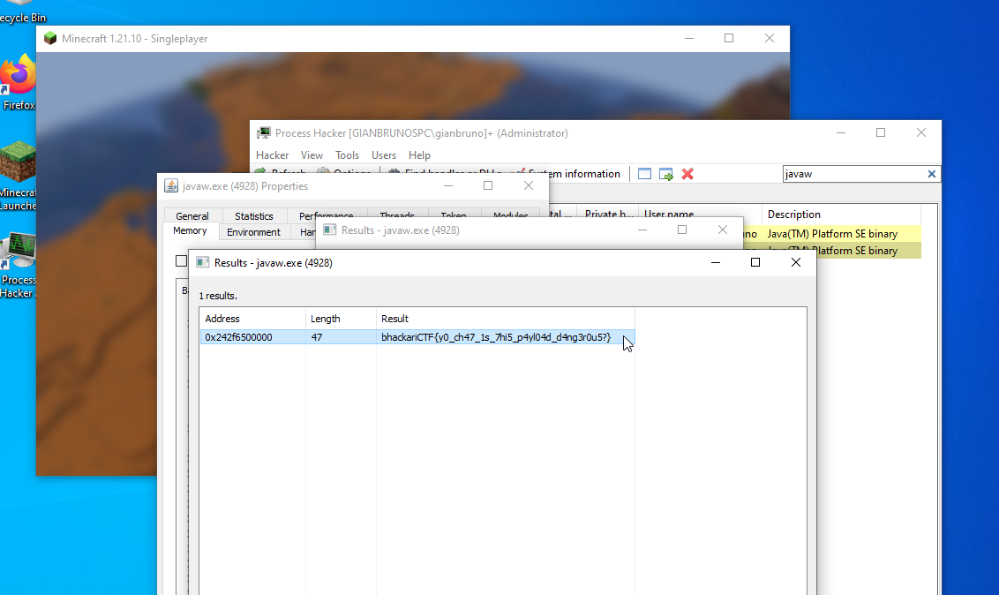

# Writeup: Gianbruno's Injection Client 2 

*This is the INTENDED SOLUTION, this challenge could also be solved by reversing the client*

Now that we have the client Gianbruno used we can try to play around with it, you can open it by executing it as an administrator

We can verify that the client is actually injecting cheat modules since we can fly in survival after pressing `F`

The challenge was asking about wether the client was injecting something else (other than the cheats), therefore we can use `Process Hacker` or whatever tool you prefer to scan and read any process memory

We want to scan `javaw.exe` (aka Minecraft) since it's the one being injected

With the game still on, we can start searching for any suspicious pattern (or flag 0.0) 

After some basic filtering, we are rewarded with the flag

